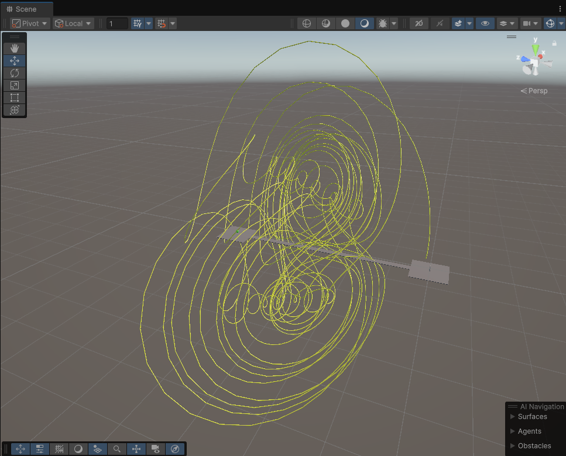
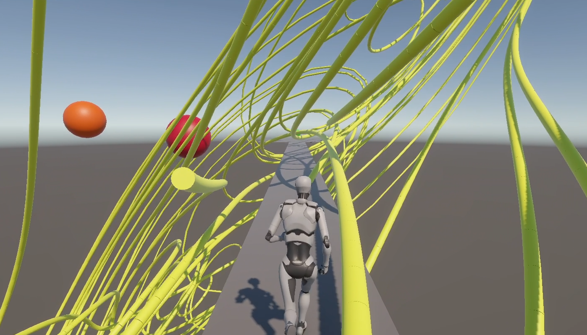
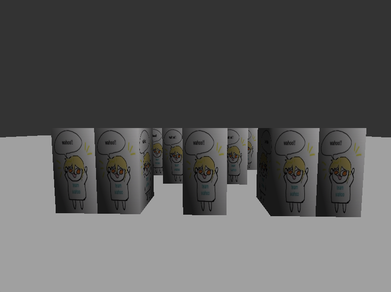
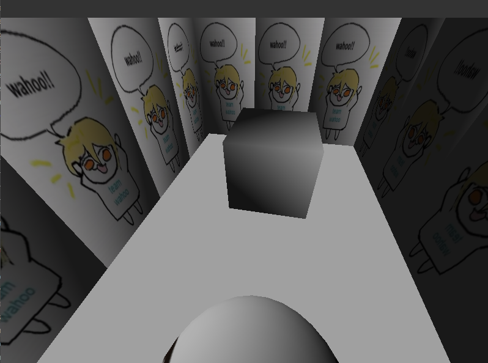

# Portfolio

This is a simple portfolio readme made with Markdown. It contains the reports and projects I have worked on, as well as some screenshots of the projects.

## Master's Final Project - Hyperchaos in Videogames
### Introduction 

In this project a hyperchaotic system has been implemented and shown in a videogame. The game generates a hyperchaotic trajectory and uses it to generate a path for traps to follow and push the player off the platform. Other enemies spawn along the path and shoot projectiles at the player. The player must avoid the traps and enemies while trying to reach the end of the level. The project is implemented in C# using the Unity game engine. The hyperchaotic system is based on the Chen's system, which is a well-known chaotic system. The project is a demonstration of how chaos theory can be used in videogames to create interesting and unpredictable gameplay.





## Textures
### Introduction

The goal of this assignment is to implement a maze using OpenGL and CSharp. This has been done making use of code previously implemented during the lectures. The code has been modified to fix some small mistakes - such as the camera moving sideways if the player collided with something on their side.

### The changes

After analyzing the code it has been clear there was a circular dependency on the Controller class and the Window class. Window had a member of type Controller and Controller had a member of type Window. This was due to the Controller needing to close the window when the timer ran out. The relevant fragments of code are below (parts irrelevant to the issue have been removed):

```csharp
public class Window : GameWindow
{
  //...
  private Controller _controller;
  //...
  public void CloseWindow() {
    Close();
  }
}


public class Controller : IController {
  //...
  private float _timeElapsed = 0.0f;
  private int _timeElapsedSeconds = 0;
  private int _timerMax = 10; // when this many seconds have elapsed the player will have lost
  public bool killGameWhenTimeElapsed {get; set;} = true;
  private Window window;

  //...
  public void UpdateState(KeyboardState kbstate,MouseState mstate, FrameEventArgs e)
  {
    //...
    // Timer stuff 
    _timeElapsed += _deltaTime;
    if ((int)_timeElapsed!= _timeElapsedSeconds)
    {
      // When casting it we'll round down the seconds elapsed, without taking the floating point
      _timeElapsedSeconds = (int)_timeElapsed;
      if (_timeElapsedSeconds >= _timerMax && killGameWhenTimeElapsed) {
        Console.WriteLine("YOU LOSE");
        window.CloseWindow();
      }
    }

  }
}
```

This was solved by use of the Observer pattern. The Controller class now has instead a delegate and event set to public privacy. Instead of having Window as an attribute of Controller, we send a message to everyone listening to the event of the timer running out. Window, in turn, subscribes to this event and calls the pertaining method to close the window. The relevant code is below:

```csharp
public class Window : GameWindow
{
  //...
  private Controller _controller;
  //...
  public Window(GameWindowSettings gameWindowSettings, NativeWindowSettings nativeWindowSettings) : base(gameWindowSettings,nativeWindowSettings)
  {
    //...
    _controller.TimerRanDownEvent += CloseWindow;
  }
  //...
  public void CloseWindow() {
    Close();
  }
}


public class Controller : IController {
  //...
  private float _timeElapsed = 0.0f;
  private int _timeElapsedSeconds = 0;
  private int _timerMax = 10; // when this many seconds have elapsed the player will have lost
  public bool killGameWhenTimeElapsed {get; set;} = true;
  public delegate void TimerRanDown();
  public event TimerRanDown? TimerRanDownEvent;

  //...
  public void UpdateState(KeyboardState kbstate,MouseState mstate, FrameEventArgs e)
  {
    //...
    // Timer stuff 
    _timeElapsed += _deltaTime;
    if ((int)_timeElapsed!= _timeElapsedSeconds)
    {
      // When casting it we'll round down the seconds elapsed, without taking the floating point
      _timeElapsedSeconds = (int)_timeElapsed;
      if (_timeElapsedSeconds >= _timerMax && killGameWhenTimeElapsed) {
        Console.WriteLine("YOU LOSE");
        TimerRanDownEvent?.Invoke();
      }
    }

  }
}
```

In this fashion, we may call on whoever might be interested in the event of the timer running out. This way, we avoid the circular dependency and the code is more modular and easier to understand.

### Screenshots



This is the outside of the maze. It was built (painstankingly) using walls scaled up in height. The walls are textured with a image as a demonstration that the texture can be changed.


This is the inside of the maze, through one of the entrances. The camera is tilted down to look at the player beneath it. The camera has been moved to above the player so the maze is easier to navigate.



The objective is easy to tell apart for the lack of texture, done on purpose. The player must reach this point to win the game. The objective has been caged in walls as to avoid the player walking around the maze to reach it.


